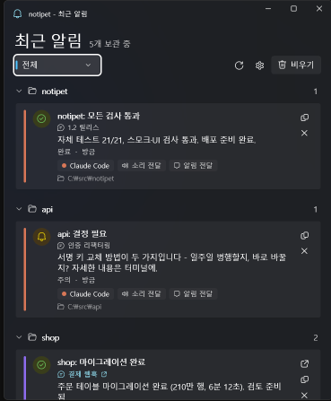
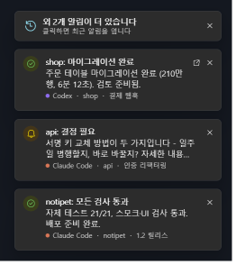
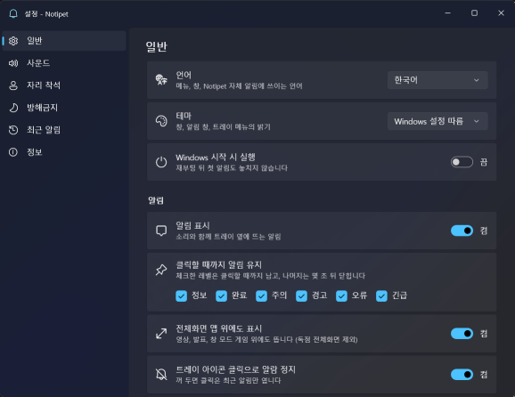

<div align="center">

# 🔔 notipet

**AI 코딩 에이전트가 나를 필요로 할 때 소리로 알려 주는 윈도우 트레이 앱**

[English](README.md) | 한국어

[](#설치)
[](https://dotnet.microsoft.com/)
[](https://learn.microsoft.com/windows/apps/winui/winui3/)
[](#)
[](LICENSE)
<br>
[](#에이전트-연결)
[](#에이전트-연결)
[](#보안)

</div>

Claude Code나 Codex에 긴 작업을 맡기고 다른 일을 하다 보면, 에이전트가 권한 승인을 기다리며 30분째 멈춰 있는 걸 뒤늦게 발견하곤 합니다. **notipet**은 트레이에 상주하다가 에이전트가 나를 필요로 하는 순간 — 질문, 승인, 오류, 긴 작업 완료 — 소리와 알림으로 알려 줍니다.

<p align="center">
  
  &nbsp;
  
</p>

## 기능

- **레벨별 소리** — `info`는 한 번, `attention`은 반복, `critical`은 확인할 때까지. 내 윈도우 소리를 그대로 쓰되 볼륨과 반복은 notipet이 정합니다.
- **훅과 스킬** — 훅은 "입력 대기", "턴 완료"를 놓치지 않고, 스킬은 에이전트가 **무엇이** 필요한지 직접 쓰게 합니다.
- **프로젝트별 최근 알림** — 카드마다 보낸 에이전트, 앱에서 쓰는 스레드 이름, 막혔다면 그 이유까지 보입니다.
- **스레드로 바로 이동** — 카드를 누르면 그 대화가 **Codex**나 **Claude** 데스크톱 앱에서 열립니다.
- **클릭할 때까지 남는 알림 창**(레벨별 선택), **전체화면 앱 위에도 뜨는 알림 창**(선택). 누르면 알람이 멈추고, 입력 중인 창의 포커스는 뺏지 않습니다. 너무 많이 쌓이면 오래된 것은 사라지지 않고 "외 N개" 카드로 모입니다.
- **저절로 꺼지는 알람** — 휴대폰에서 승인했거나 에이전트가 스스로 해결했으면, 에이전트가 그렇다고 알리고 **그 알람과 그 알림 창만** 꺼집니다. 이미 껐다면 아무 일도 없습니다.
- **PC 앞에 있음** — 자리에 있을 때는 긴 알람을 짧게, 또는 조용한 소리로 바꿉니다.
- **방해금지, 음소거, 레이트 리밋, 중복 병합** — 툴 호출마다 훅이 터져도 트레이가 기관총이 되지 않습니다.
- **English / 한국어** UI, Fluent 디자인, 라이트·다크.
- **로컬 전용** — 베어러 토큰이 걸린 루프백 HTTP API. 원격 전송·텔레메트리 없음.

## 동작 방식

```
Claude Code / Codex  ──훅 / 스킬──>  notipet.exe (CLI)  ──HTTP 127.0.0.1──>  NotipetTray.exe (트레이)
                                                                             ├─ 소리
                                                                             ├─ 알림 / 알림 창
                                                                             └─ 최근 알림
```

누가, 어디서 보냈는지는 CLI가 알아서 채웁니다. 에이전트와 스레드 ID는 에이전트의 환경 변수(`CLAUDE_CODE_SESSION_ID`, `CODEX_SESSION_ID` …)에서, 프로젝트는 지금 있는 저장소에서 가져옵니다. 빠진 정보가 있어도 괜찮습니다 — "기타"로 분류될 뿐입니다.

## 설치

Windows 10(19041) 이상 또는 11, x64. 빌드에는 [.NET 10 SDK](https://dotnet.microsoft.com/download)가 필요합니다.

```powershell
git clone https://github.com/EvanHexX/notipet C:\src\notipet
cd C:\src\notipet
.\scripts\publish.ps1            # bin\NotipetTray.exe, bin\notipet.exe 생성 (-Restart: 실행 중인 것 교체)
.\bin\NotipetTray.exe            # 트레이에 상주
.\bin\notipet.exe test           # 소리와 알림 확인
```

`C:\src\notipet`은 예시 경로입니다. `install-hooks`와 `install-skill`은 실제 경로를 채워서 출력합니다.

## 에이전트 연결

**훅** (권한 대기·턴 완료를 놓치지 않음):

```powershell
.\bin\notipet.exe install-hooks   # ~/.claude/settings.json, ~/.codex/config.toml에 넣을 블록 출력
```

**스킬** (에이전트가 언제 보낼지 판단하고 필요한 내용을 씀):

```powershell
.\bin\notipet.exe install-skill            # Claude Code
.\bin\notipet.exe install-skill --codex    # Codex
```

둘 다 쓰는 게 가장 좋습니다 — [docs/SKILL.md](docs/SKILL.md). Codex는 hooks 시스템을 쓰며 **`notify` 설정은 건드리지 않습니다.**

직접 보낼 수도 있습니다:

```powershell
notipet send --title "api: 결정 필요" --body "키를 지금 바꿀까요, 일주일 병행할까요?" `
             --level attention --project api --thread-title "인증 리팩터링"
```

## 화면

<p align="center">
  
</p>

## 레벨

| 레벨 | 기본 | 주로 |
|---|---|---|
| `info` | 1회 | 그 밖의 이벤트 |
| `success` | 1회 | 턴·긴 작업 완료 |
| `attention` | 반복 | **권한·입력 대기** |
| `warn` | 1회 | 경고 |
| `error` | 3회 반복 | 실패, 진행 불가 |
| `critical` | 확인할 때까지 | 놓치면 안 되는 것 |

울리는 알람은 트레이 아이콘이나 알림 클릭, `notipet ack`로 멈춥니다. 보낸 쪽도 끌 수 있습니다 — 턴이 끝나면 그 권한 요청 알람이, `notipet resolve`를 부르면 에이전트가 알린 알람이 꺼집니다. 반복 방식은 설정 → 사운드에서 레벨마다 바꿀 수 있고, "확인할 때까지"는 최대 지속 시간을 **무제한**으로 두지 않는 한 그 시간에 멈춥니다.

## CLI

```
notipet send --title T --body B [--level L] [--tag T] [--project P] [--thread-title T]
notipet status | ping | version | doctor
notipet history [--limit N] | history clear
notipet ack | resolve [--tag T] | mute [30m|off] | desk [on|off]
notipet open [recent|settings]
notipet start | stop | restart
notipet install-hooks | install-skill
```

명령 없이 부르면 에이전트 훅 페이로드로 읽고 아무것도 출력하지 않습니다. **종료 코드는 항상 0**(`--strict` 제외) — notipet이 꺼져 있어도 에이전트 동작이 바뀌지 않습니다. 전체: [docs/CLI.md](docs/CLI.md).

## 보안

API는 `127.0.0.1`에서만 열리고 베어러 토큰(`%LOCALAPPDATA%\notipet\runtime.json`)이 필요합니다. 브라우저 요청(`Origin` / `Sec-Fetch-Site`)은 거부하고, DNS 리바인딩에 대비해 `Host`를 검사합니다. 무엇을 막고 무엇을 막지 못하는지는 [docs/modules/discovery_auth.md](docs/modules/discovery_auth.md)에 있습니다. 취약점은 [SECURITY.md](SECURITY.md)의 방법으로 알려 주세요.

## 빌드와 검증

```powershell
dotnet build notipet.slnx
.\app\bin\Debug\net10.0-windows10.0.19041.0\win-x64\NotipetTray.exe --self-test   # 무음·헤드리스
.\cli\bin\Debug\net10.0\win-x64\notipet.exe --self-test
.\scripts\smoke.ps1 -FromBuildOutput -Configuration Debug                        # 실제 데몬 대상
.\scripts\ui-check.ps1 -FromBuildOutput -Configuration Debug                     # 모든 창을 실제로 열어 봄
```

코드는 `core/`(Windows 없는 .NET — 규칙, 디스패치, HTTP API, 설정), `app/`(윈도우 트레이 앱), `cli/`(NativeAOT)로 나뉩니다. [docs/PROJECT_MAP.md](docs/PROJECT_MAP.md) 참고.

## 문서

| | |
|---|---|
| [docs/USAGE.md](docs/USAGE.md) | 설치, 연동, 트레이와 창, 문제 해결 |
| [docs/CLI.md](docs/CLI.md) | CLI 명령 전체 |
| [docs/SKILL.md](docs/SKILL.md) | 에이전트 스킬, 훅과의 차이 |
| [docs/settings.md](docs/settings.md) | `settings.json` 전체 |
| [docs/api.md](docs/api.md) | HTTP API |
| [docs/IDEAS.md](docs/IDEAS.md) | 다음에 할 만한 것 |

## 로드맵

- [x] 트레이, 로컬 API, 레벨별 소리, 훅과 스킬
- [x] 설정·최근 알림 창, English/한국어, 프로젝트별 묶기, 스레드로 이동
- [x] 클릭할 때까지 남고 전체화면 위에도 뜨는 알림 창
- [ ] 업데이트되는 설치 프로그램, Codex/Claude 플러그인
- [ ] 자리를 비웠을 때 휴대폰 푸시 (Bark / Pushover)
- [ ] macOS (플랫폼 중립 `core/`가 그 시작)

## 라이선스

[MIT](LICENSE)
