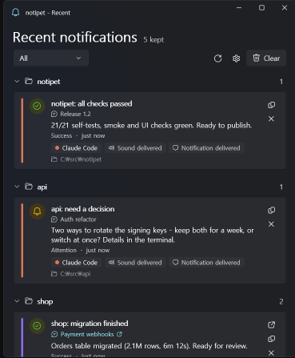
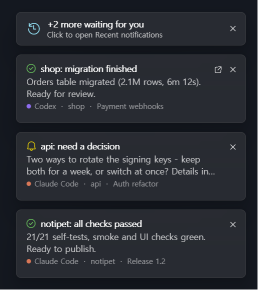
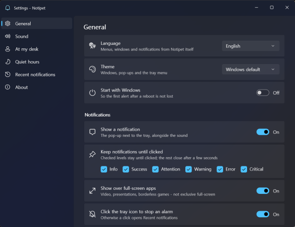

<div align="center">

# 🔔 notipet

**A Windows tray app that makes a sound when your AI coding agent needs you.**

English | [한국어](README.ko.md)

[](#install)
[](https://dotnet.microsoft.com/)
[](https://learn.microsoft.com/windows/apps/winui/winui3/)
[](#)
[](LICENSE)
<br>
[](#connect-your-agents)
[](#connect-your-agents)
[](#security)

</div>

You start a long task in Claude Code or Codex and switch to something else. Forty minutes later it is waiting on a permission prompt - and has been for half an hour. **notipet** sits in the tray and makes a noise at the moment the agent needs you: a question, an approval, an error, or a long task that just finished.

<p align="center">
  
  &nbsp;
  
</p>

## Features

- **Sound by level** - `info` plays once, `attention` repeats, `critical` rings until you acknowledge it. Uses your own Windows sounds, with volume and repeat control.
- **Agent hooks and an agent skill** - hooks never miss "waiting for input" or "turn finished"; the skill lets the agent say *what* it needs.
- **Recent notifications, grouped by project** - each card shows which agent sent it (colour stripe + badge), the thread name the agent app uses, and why a notification was held back if it was.
- **Jump to the thread** - click a card to open that conversation in the **Codex** or **Claude** desktop app.
- **Pop-ups that stay until clicked** (you pick the levels) and that show **over full-screen apps** - optional; clicking one stops the alarm, they never steal keyboard focus, and when too many pile up the older ones fold into a "+N more" card instead of vanishing.
- **At my desk** - shorten long alarms, or swap them for a quieter sound, while you are at the PC.
- **Quiet hours, mute, rate limit, dedupe** - a hook firing on every tool call does not turn the tray into a machine gun.
- **English / 한국어** UI, Fluent design, light and dark.
- **Local only** - a loopback HTTP API with a bearer token. No telemetry, no outbound network.

## How it works

```
Claude Code / Codex  ──hook / skill──>  notipet.exe (CLI)  ──HTTP 127.0.0.1──>  NotipetTray.exe (tray)
                                                                                  ├─ sound
                                                                                  ├─ notification / pop-up
                                                                                  └─ recent notifications
```

The CLI fills in who sent it and from where on its own: the agent and thread id come from the agent's environment (`CLAUDE_CODE_SESSION_ID`, `CODEX_SESSION_ID`, ...), the project from the repository you are in. Anything missing is fine - the card lands under "Other".

## Install

Requires Windows 10 (19041) or 11, x64, and the [.NET 10 SDK](https://dotnet.microsoft.com/download) to build.

```powershell
git clone https://github.com/EvanHexX/notipet C:\src\notipet
cd C:\src\notipet
.\scripts\publish.ps1            # builds bin\NotipetTray.exe and bin\notipet.exe (-Restart replaces a running one)
.\bin\NotipetTray.exe            # starts in the tray
.\bin\notipet.exe test           # you should hear it and see it
```

`C:\src\notipet` is just an example path. `install-hooks` and `install-skill` print the real one.

## Connect your agents

**Hooks** (never miss a prompt or a finished turn):

```powershell
.\bin\notipet.exe install-hooks   # prints the blocks for ~/.claude/settings.json and ~/.codex/config.toml
```

**Skill** (the agent decides when and writes what it needs):

```powershell
.\bin\notipet.exe install-skill            # Claude Code
.\bin\notipet.exe install-skill --codex    # Codex
```

Using both works best - see [docs/SKILL.md](docs/SKILL.md). For Codex, notipet uses the hooks system and **never touches your `notify` setting**.

An agent (or you) can also send one directly:

```powershell
notipet send --title "api: need a decision" --body "Rotate keys now or keep both for a week?" `
             --level attention --project api --thread-title "auth refactor"
```

## Screens

<p align="center">
  
</p>

## Levels

| Level | Default | Typically |
|---|---|---|
| `info` | once | anything else |
| `success` | once | a turn or long task finished |
| `attention` | repeats | **waiting for permission or input** |
| `warn` | once | warnings |
| `error` | repeats 3x | failed, cannot continue |
| `critical` | until acknowledged | must not be missed |

Stop a ringing alarm with a click on the tray icon or the notification, or `notipet ack`. Every repeat mode can be changed per level in Settings → Sound; "until acknowledged" is capped by a maximum duration unless you choose **No limit**.

## CLI

```
notipet send --title T --body B [--level L] [--tag T] [--project P] [--thread-title T]
notipet status | ping | version | doctor
notipet history [--limit N] | history clear
notipet ack | mute [30m|off] | desk [on|off]
notipet open [recent|settings]
notipet start | stop | restart
notipet install-hooks | install-skill
```

Without a command it reads an agent hook payload and prints nothing. **It always exits 0** (unless `--strict`), so notipet being down can never change what your agent does. Full reference: [docs/CLI.md](docs/CLI.md).

## Security

The API listens on `127.0.0.1` only and needs a bearer token, kept in `%LOCALAPPDATA%\notipet\runtime.json`. It refuses browser requests (`Origin` / `Sec-Fetch-Site`) and checks `Host` against DNS rebinding. What this does and does not protect against is written down in [docs/modules/discovery_auth.md](docs/modules/discovery_auth.md). Report vulnerabilities as described in [SECURITY.md](SECURITY.md).

## Build and test

```powershell
dotnet build notipet.slnx
.\app\bin\Debug\net10.0-windows10.0.19041.0\win-x64\NotipetTray.exe --self-test   # headless, silent
.\cli\bin\Debug\net10.0\win-x64\notipet.exe --self-test
.\scripts\smoke.ps1 -FromBuildOutput -Configuration Debug                        # against a live daemon
.\scripts\ui-check.ps1 -FromBuildOutput -Configuration Debug                     # opens every window
```

The code is split into `core/` (plain .NET, no Windows - rules, dispatch, HTTP API, settings), `app/` (the Windows tray app) and `cli/` (NativeAOT). See [docs/PROJECT_MAP.md](docs/PROJECT_MAP.md).

## Documentation

The detailed docs are in Korean.

| | |
|---|---|
| [docs/USAGE.md](docs/USAGE.md) | install, agent setup, tray and windows, troubleshooting |
| [docs/CLI.md](docs/CLI.md) | every CLI command |
| [docs/SKILL.md](docs/SKILL.md) | the agent skill, hooks vs skill |
| [docs/settings.md](docs/settings.md) | `settings.json` reference |
| [docs/api.md](docs/api.md) | HTTP API |
| [docs/IDEAS.md](docs/IDEAS.md) | what might come next |

## Roadmap

- [x] Tray, local API, sounds by level, agent hooks and skill
- [x] Settings and recent-notifications windows, English/Korean, project grouping, jump to thread
- [x] Pop-ups that stay until clicked and show over full-screen apps
- [ ] Installer with updates, Codex/Claude plugin packaging
- [ ] Phone push when you are away (Bark / Pushover)
- [ ] macOS (the platform-neutral `core/` is the start)

## License

[MIT](LICENSE)
